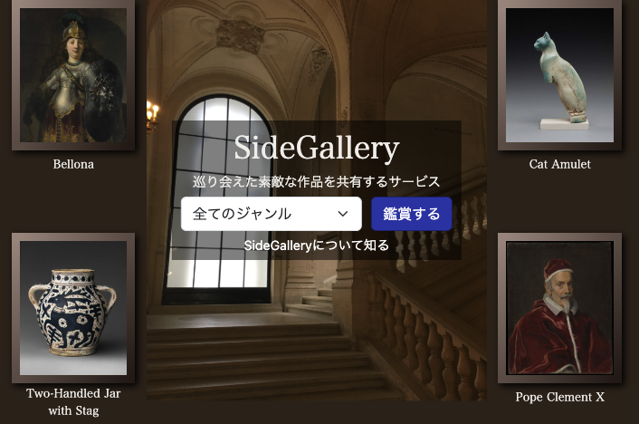
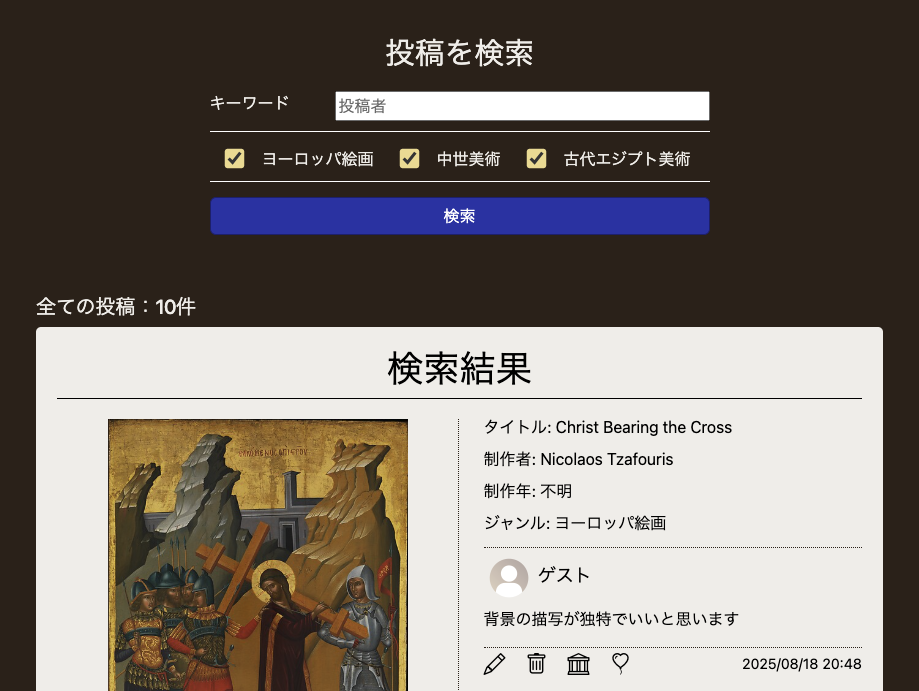
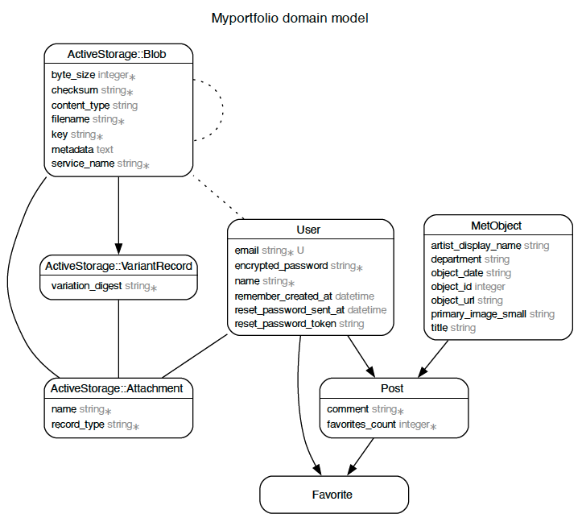
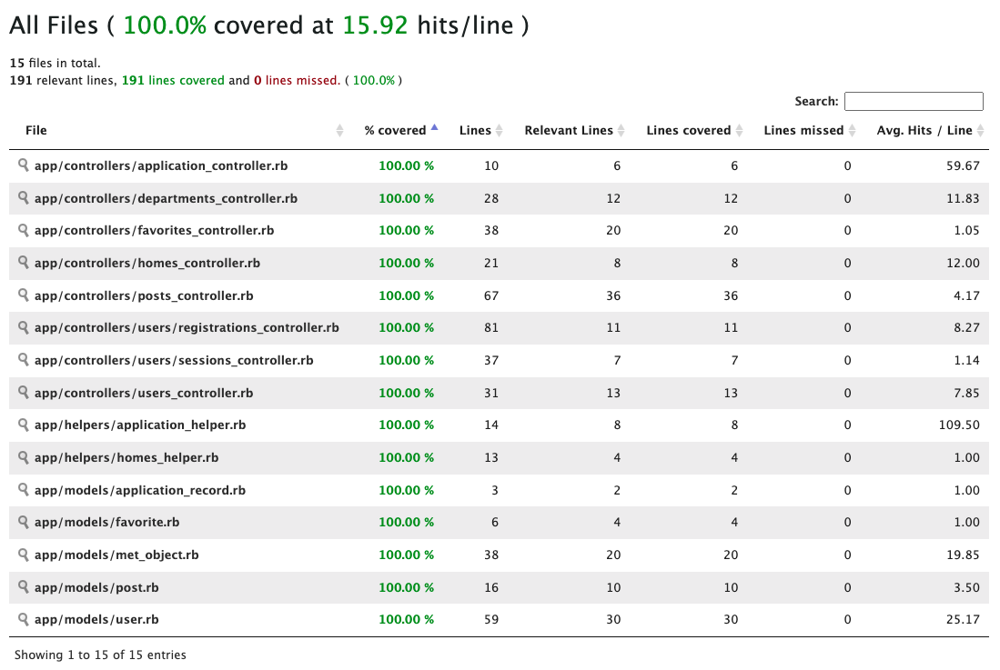

# SideGallery

<h3>SideGalleryは、巡り会えた素敵な美術作品を共有するサービスです</h3>

  

# サービスURL
[https://sidegallery.herokuapp.com/](https://mb-myportfolio-898f86d4fd9e.herokuapp.com/)
  

## 1. SideGalleryの概要

SideGalleryは、
観光中に偶然見つけた脇道や路地裏のような、本筋とは異なる場所で巡り会えた作品との出会いをコンセプトに制作されたサービスです。

SideGalleryでは、アメリカのメトロポリタン美術館の膨大な所蔵作品からAPIにより作品画像を取得しております。

そして、著名な作品は元より、普段なら検索することもないような作品にも１つ１つ均等に鑑賞できるスペースを設けております。

その中から出会った印象的な作品は、コメントをつけて投稿し、他のユーザや閲覧者に共有できるのが特徴です。
  

## 2. 開発の背景

APIを使用したアプリのアイデアを考えていた時に、メトロポリタン美術館が所蔵作品をAPIとして公開していることを知りました。

私は美術館に行くのが好きなこともあり、また、このAPIを使用したアプリも見られなかったことから、アプリの開発にこのAPIを使用することに決めました。

そして、脇道に入ったような少し秘密な場所で、美術の好きな人や興味のある人が、メトロポリタン美術館の膨大な所蔵作品の中からたまたま出会った印象的な作品を共有し合う楽しみの場を作りたいと考えたため、本アプリを開発しました。
  

## 3. 利用の仕方
|　トップページ	|　ヘッダー　|
| ---- | ---- |
|  |  |
| トップページではセレクトボックスから、 鑑賞したい作品のジャンルを指定して 鑑賞ボタンを押すと鑑賞ページに遷移できます。  新着投稿の欄にはユーザが投稿した作品が 掲載されております。  もっと見るボタンを押すと、 投稿一覧画面に遷移します。 | ヘッダーでは投稿一覧、鑑賞リンクをはじめ、 新規登録やログインボタンを用意しております。  ゲストログイン機能により、 新規登録せずにサービスを利用することもできます。  ログインすると、これらのボタンはユーザー欄に変わり、 クリックするとマイページ等のメニューが表示されます。 |

|　鑑賞ページ	|　新規投稿　|
| ---- | ---- |
|  |  |
| 鑑賞ページでは、 メトロポリタン美術館の所蔵作品のうち、 指定したジャンルから9枚の作品が 無作為に選ばれて表示されます。 各作品は画像をクリックすると より大きな画像を表示できます。  作品の説明欄では、 をクリックすると メトロポリタン美術館の外部リンクで 作品の詳細を見ることができます。  気に入った作品は「この作品を投稿」を クリックすると、新規投稿に遷移します。| 新規投稿では、気に入った作品にコメントをつけて 投稿することができます。 その作品の好きなところや、 良いと思うところを是非書いて投稿しましょう。 |

|　投稿一覧	|　マイページ　|
| ---- | ---- |
|  |  |
| 投稿一覧では、 投稿者や作品のジャンルを選択して 投稿内容を検索することができます。  投稿のユーザ欄をクリックすると、 そのユーザのマイページに遷移します。  気に入った投稿はを押して いいねをすることが可能です。  自ユーザの投稿には、 編集と削除ボタンが表示され 投稿の編集や削除ができます。 | マイページでは、そのユーザの投稿数、いいね数、 いいねされた数が表示されます。  また、そのユーザの投稿内容や いいねした投稿を見ることもできます。  マイページでは自ユーザのページに限り、 ユーザの設定ボタンが表示されます。 (ゲストの場合は表示されません。) |

## 4. 機能まとめ

* ユーザ新規登録(devise使用)
* ログイン(devise使用)
* ゲストログイン
  
* 投稿一覧
  * 検索機能(ransack使用)
    * 投稿者・ジャンル指定
* ユーザごとの投稿一覧・いいね一覧
  
* 作品の鑑賞
  * ジャンル選択セレクトボックス
  * 作品の画像・タイトル・制作者・ジャンル
  * メトロポリタン美術館の外部リンク
  * 作品の投稿
  

## 5. 使用技術

|　カテゴリー	|　使用技術　|
| ---- | ---- |
| フロントエンド | HTML・CSS・Javascript Bootstrap(一部UIフレームワーク) |
| バックエンド | Ruby 3.3.3 Ruby on Rails 6.1.3.2 |
| データベース | PostgreSQL |
| インフラ | Heroku(デプロイ) AWS(ユーザアイコンのストレージ)|
| 開発環境 / 開発ツール | Git / GitHub(バージョンの管理) RSpec(テストのフレームワーク) SimpleCov（テストカバレッジ計測） Rubocop(コードの静的解析) Bullet（N+1クエリの検出） |
| CI/CD | CircleCI （RSpec・Rubocopの自動実行、Herokuへの自動デプロイ） |
| API | The Metropolitan Museum of Art Collection API |

## 6. ER図

以下は、本サービスのER図になります。 
Userモデルは、ActiveStorageによるアイコン画像機能を有しております。 
MetObjectモデルにはAPIにより取得された作品データが格納されており、 
鑑賞ページで表示される作品を基にPostモデルによる投稿を行うことができます。 
気に入った投稿は、Favoriteモデルによりいいねをすることができます。

  

## 7. テスト
テストはmodel specによる単体テスト、request specによる結合テストを実施しており、 
simplecovによるカバレッジ計測100%を達成しております。(下画像参照) 
また、カバレッジの達成に加えて、 
未ログイン時やゲストログイン時のアクセス制限や一部機能の制限などは 網羅的な検証を行っております。 
その他、カバレッジの計測対象外となっている、 動的に生成されるHTMLの要素が正しく含まれていることの検証も合わせて行っております。

  

## 8. 今後の展望

以下の内容を目標としております。

* google認証機能の実装
* 投稿の並び替え機能の実装(投稿日時順・いいね順)
* ユーザフォロー機能の実装
* 取り扱うジャンルの拡大
* system_specの実装

